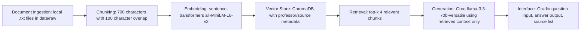

# Project 1 Planning: The Unofficial Guide

> Write this document before you write any pipeline code.
> Your spec and architecture diagram are what you'll use to direct AI tools (Claude, Copilot, etc.) to generate your implementation — the more specific they are, the more useful the generated code will be.
> Update the Retrieval Approach and Chunking Strategy sections if you change your approach during implementation.
> Update this file before starting any stretch features.

---

## Domain

My domain is unofficial student reviews of DePaul University professors using Rate My Professors reviews. This knowledge is valuable because official DePaul course catalogs and department pages usually list course descriptions, instructor names, and academic requirements, but they do not explain what students actually experience in the class. Students often want unofficial information about teaching style, grading, workload, attendance expectations, feedback quality, and whether a professor is helpful or difficult.

This knowledge can be hard to find through official channels because it comes from student experience rather than university-published material. A RAG system can make these reviews easier to search by letting users ask natural-language questions such as “Which professors are caring?” or “Is this professor difficult?” and receive grounded answers from collected student reviews.

---

## Documents

I collected Rate My Professors review text for 10 DePaul University professors. Each professor profile is saved as one plain text document in `data/raw/`. Each document includes the professor name, department, overall rating information, source URL, and cleaned student review text.

| # | Source | Description | URL or location |
|---|--------|-------------|-----------------|
| 1 | Rate My Professors — Eric Landahl | Physics professor at DePaul University | `data/raw/eric_landahl.txt` — Source URL included in raw file |
| 2 | Rate My Professors — Kristina Thomas | Cinema professor at DePaul University | `data/raw/kristina_thomas.txt` — Source URL included in raw file |
| 3 | Rate My Professors — Yang Choi | Ethnic Studies professor at DePaul University | `data/raw/yang_choi.txt` — Source URL included in raw file |
| 4 | Rate My Professors — Kenny Castellanos | Computer Science professor at DePaul University | `data/raw/kenny_castellanos.txt` — Source URL included in raw file |
| 5 | Rate My Professors — Nancy Brown | History professor at DePaul University | `data/raw/nancy_brown.txt` — Source URL included in raw file |
| 6 | Rate My Professors — Xorla Ocloo | African & Black Diaspora Studies professor at DePaul University | `data/raw/xorla_ocloo.txt` — Source URL included in raw file |
| 7 | Rate My Professors — Juan Hu | Mathematics professor at DePaul University | `data/raw/juan_hu.txt` — Source URL included in raw file |
| 8 | Rate My Professors — Emily Barnard | Mathematics professor at DePaul University | `data/raw/emily_barnard.txt` — Source URL included in raw file |
| 9 | Rate My Professors — Naomi Wangler | Health professor at DePaul University | `data/raw/naomi_wangler.txt` — Source URL included in raw file |
| 10 | Rate My Professors — Kaitlyn Bolyard | Writing professor at DePaul University | `data/raw/kaitlyn_bolyard.txt` — Source URL included in raw file |

---

## Chunking Strategy

**Chunk size:** 700 characters

**Overlap:** 100 characters

**Reasoning:**

My documents are Rate My Professors reviews, which are short, opinion-based, and usually organized by individual student ratings. A 700-character chunk is large enough to preserve a complete review or a small group of related review details, such as course code, attendance, grading comments, and a student’s explanation of the professor’s teaching style. If the chunks were much smaller, important context could be separated from the opinion, such as a complaint about exams being separated from the course name or professor name.

I will use 100 characters of overlap so that details near a chunk boundary are not lost. This matters because a review may mention the professor name, course, and main opinion across several lines. The overlap helps retrieval still find the relevant information even if the exact answer spans two adjacent chunks.

Before chunking, I will clean the copied text by removing website clutter such as “Rate,” “Compare,” “Helpful,” thumbs up/down counts, ads, navigation text, and unrelated promotional material. I will keep professor names, departments, rating summaries, course codes, dates, attendance information, difficulty ratings, tags, and student review text.

---

## Retrieval Approach

**Embedding model:** `all-MiniLM-L6-v2` from `sentence-transformers`

**Top-k:** 4

**Production tradeoff reflection:**

I will use `all-MiniLM-L6-v2` because it runs locally, is free, does not require an embedding API key, and is recommended for this project. It should work well for short student-review text because it can capture semantic similarity even when the user’s query does not use the exact same words as the review. For example, a query about whether a professor is “helpful” might retrieve reviews that say the professor is “accessible,” “caring,” or “willing to explain.”

I will retrieve the top 4 chunks for each query. Top-k of 4 gives the LLM enough evidence to answer while limiting the amount of unrelated review text. If top-k were too low, the system might miss the best evidence. If top-k were too high, the generator might receive too many loosely related chunks and produce a less focused answer.

For a production deployment, I would compare embedding models based on accuracy, latency, cost, privacy, context length, and multilingual support. A larger API-based model might produce more accurate retrieval for subtle or messy student language, but it could cost more and introduce latency. A local model is cheaper and keeps the data private, but it may be weaker on nuanced questions or uncommon phrasing.

---

## Evaluation Plan

| # | Question | Expected answer |
|---|----------|-----------------|
| 1 | What do students say about Eric Landahl’s lecture style? | Reviews are mixed. Some students say he does not lecture much and students have to figure things out themselves, while others say the lab-based structure can still help students learn if they put in effort. |
| 2 | Is Kenny Castellanos described as difficult? | Yes. Many reviews describe his classes as very difficult, with difficult assignments, strict deadlines, test-heavy work, confusing explanations, and several students warning others not to take him. |
| 3 | What do students say about Kaitlyn Bolyard’s feedback and grading? | Students generally describe Bolyard as kind, clear, and helpful. Several reviews mention clear grading criteria, detailed or helpful feedback, easy grading, extra credit, and manageable writing assignments. |
| 4 | Which professors are described as caring or helpful? | Possible correct answers include Xorla Ocloo, Nancy Brown, Kaitlyn Bolyard, Emily Barnard, Juan Hu, Naomi Wangler, and Eric Landahl, depending on retrieved chunks. The answer should name professors whose reviews explicitly mention caring, helpfulness, accessibility, or support. |
| 5 | What complaints do students make about Kristina Thomas? | Complaints include unclear expectations, limited feedback, arbitrary grading, lectures that are hard to follow, difficulty talking to her, issues with required materials, and negative experiences in SCWR302. |

---

## Anticipated Challenges

1. The reviews are noisy and sometimes contradictory. For example, one student may describe a professor as caring and helpful, while another student may describe the same professor as unclear or frustrating. The system needs to summarize patterns from the retrieved chunks rather than treat one review as the only truth.

2. Retrieval may return chunks for the wrong professor if multiple reviews use similar words like “caring,” “hard,” “lecture heavy,” or “tough grader.” To reduce this risk, I will store metadata such as professor name, source file, and chunk index with every chunk.

3. Chunk boundaries could split useful information. For example, a course code or professor name might appear before the main review text. The 100-character overlap should help keep related information together, but I will inspect sample chunks to make sure they are readable and self-contained.

4. Source attribution could fail if metadata is not preserved through ingestion, chunking, embedding, and retrieval. I will make sure each chunk includes its source filename and professor name so generated answers can cite where the evidence came from.

---

## Architecture

---

## AI Tool Plan

**Milestone 3 — Ingestion and chunking:**

I will use ChatGPT to help implement the ingestion and chunking script. I will give it my Documents section, Chunking Strategy section, and the requirement that source metadata must be preserved. I expect it to produce a Python script that loads `.txt` files from `data/raw/`, cleans the text, splits it into 700-character chunks with 100-character overlap, and saves the chunks with metadata.

I will verify the output by printing at least 5 sample chunks and checking that they are readable, non-empty, and connected to the correct professor. If the script uses the wrong chunk size, loses source filenames, or produces fragments, I will revise it.

**Milestone 4 — Embedding and retrieval:**

I will use ChatGPT to help implement embedding and retrieval with `sentence-transformers` and ChromaDB. I will give it my Retrieval Approach section and ask for code that embeds each chunk with `all-MiniLM-L6-v2`, stores chunks in ChromaDB, and retrieves the top 4 chunks for a user query.

I will verify the code by testing at least 3 evaluation questions before connecting the LLM. I will inspect the retrieved chunks and distance scores to make sure the results are actually relevant to the question.

**Milestone 5 — Generation and interface:**

I will use ChatGPT to help implement grounded generation and a Gradio interface. I will give it the grounding requirement that the model must answer only from retrieved chunks and must refuse when the chunks do not contain enough information. I expect it to produce a query function that sends retrieved context to Groq and a simple Gradio app with a question input, answer output, and source output.

I will verify the output by asking both in-scope and out-of-scope questions. For in-scope questions, the answer should cite source professor files. For out-of-scope questions, the system should say it does not have enough information instead of guessing.
